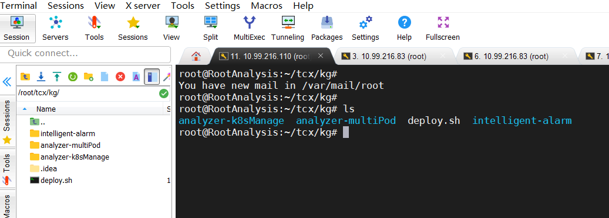
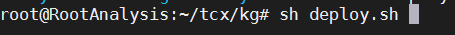
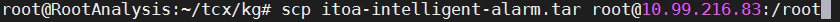
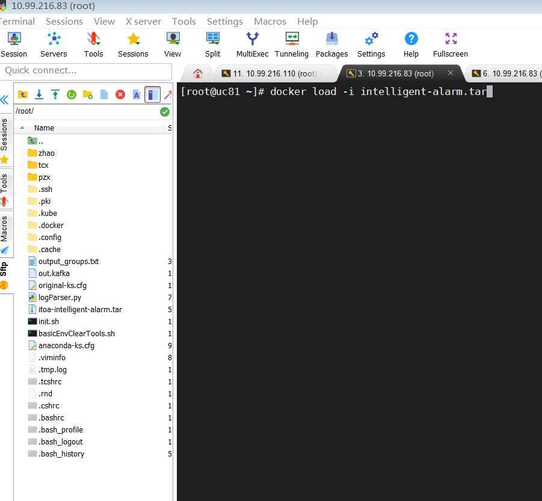
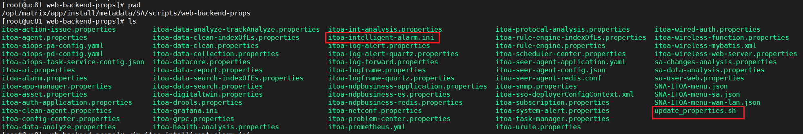
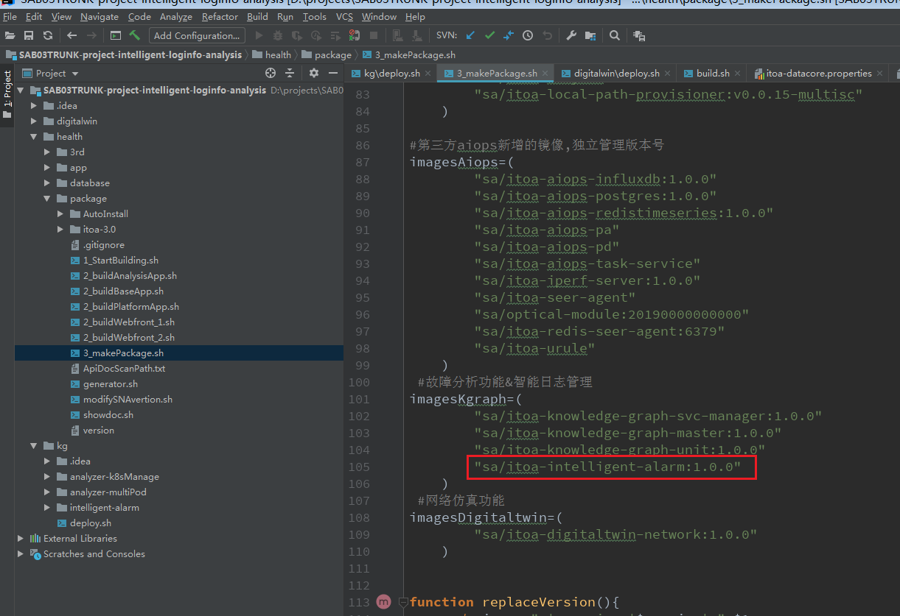

# SA打包流程

以智能告警为例

## Docker镜像创建

Dockerfile 是一个用来构建镜像的文本文件，文本内容包含了一条条构建镜像所需的指令和说明。

1. 在自己的项目路径下编写Dockerfile:

   

   Dockerfile示例：

   ```dockerfile
   FROM ubuntu:16.04
   
   RUN mkdir /root/.config\
       && mkdir /root/src\
       && mkdir /root/cfg
   
   COPY pip.conf /root/.config/pip/
   COPY sources.list /etc/apt/
   COPY cfg /root/cfg
   COPY src /root/src
   
   
   RUN apt-get autoclean\
       && apt-get update\
       && apt-get install -y --no-install-recommends\
       build-essential \
       vim\
       python3-dev\
       python3-pip
   
   RUN pip3 install  --upgrade pip
   RUN pip3 install  --upgrade wheel
   RUN pip3 --no-cache-dir install "setuptools<50.0.0" --upgrade
   
   ENV PYTHONIOENCODING utf-8
   ENV LANG C.UTF-8
   
   RUN apt-get install tzdata -y
   RUN cp /usr/share/zoneinfo/Asia/Shanghai /etc/localtime && echo 'Asia/Shanghai'>/etc/timezone
   
   EXPOSE 6688
   
   WORKDIR /root/src
   RUN pip3 install -r requirements.txt
   ```

   

2. 上传最新的项目代码到镜像打包环境（`10.99.216.110`）

   

   

3. 执行镜像构建脚本

   

   该脚本中的镜像构建命令如下：

   ```bash
   docker build  --no-cache -t sa/itoa-intelligent-alarm:1.0.0 .
   ```

4. 构建完毕后保存镜像文件

   

5. 上传镜像文件包至SA环境（`10.99.216.83`）

   

6. 在SA服务器（`10.99.216.83`）上加载镜像

   

## Pod部署

   Pod代表部署的一个单位：Kubernetes中单个应用的实例，它可能由单个容器或多个容器共享组成的资源。

   1. 编写pod的yaml配置
   
      Pod的yaml配置文件所在路径：
   
      
   
      在SA代码中的路径：
   
      `health/package/itoa-3.0/metadata/analysis/itoa-knowledge-graph/k8s-resources/itoa-intelligent-alarm.yaml`
      
      yaml配置文件示例（`itoa-intelligent-alarm.yaml`，各参数详解可参考https://www.cnblogs.com/bigberg/p/9203619.html）：

   ```yaml
   apiVersion: extensions/v1beta1
      kind: Deployment
      metadata:
       name: itoa-intelligent-alarm
       namespace: sa
    labels:
       app: intelligent-alarm
      spec:
       replicas: 1
       selector:
       matchLabels:
         app: intelligent-alarm
       template:
       metadata:
         labels:
           app: intelligent-alarm
       spec:
         nodeSelector:
           seeranalyzer-label: seeranalyzer-label
         containers:
           - name: intelligent-alarm
             command: ["sh","/root/src/start.sh"]
             image: sa/itoa-intelligent-alarm:1.0.0
             imagePullPolicy: IfNotPresent
             resources:
               limits:
                 cpu: "5"
               requests:
                 cpu: "1"
                 # hostPort: 5555
             volumeMounts:
               - name: app-prop-v
                 mountPath: /root/cfg/intelligent-alarm.ini
                 subPath: re
         volumes:
           - name: log
             emptyDir: {}
           - name: log-diag
             hostPath:
               path: /var/log/matrix-diag/SA
           - name: app-prop-v
             configMap:
               name: web-backend-props #已经创建的configMap的名称
               items:
                 - key: itoa-intelligent-alarm.ini
                   path: re
   ```


   2. 配置文件
   
      其中，configmap存储程序运行所需的外部文件，文件格式没有限制，SA环境上对应的路径：
      
      
      
      新增配置文件`itoa-intelligent-alarm.ini`，内容:
      
      ```ini
      [DEFAULT]
      timeslot = 60
      timeout = 300
      group_overlap = 10
      low_prior_filter = True
      flapping_filter = True
      kafka.consumer.servers = itoa-kafka-service1:6667
      kafka.consumer.group.id = intelligent-alarm
      kafka.consumer.topic = security
      url = http://itoa-health-analysis:8080/healthAnalysis/alarmToUCenter/send
      ```
      
      在SA项目代码中的路径为
      
      `health/package/itoa-3.0/metadata/scripts/web-backend-props/itoa-intelligent-alarm.ini`
      
      对于新增的配置文件，需执行目录下的`update_properties.sh`来使之生效，更新k8s的configmap
      
      
      
      
      
   3. 根据yaml配置创建pod
   
      进入yaml文件所在路径，执行如下命令创建pod
   
      
   
      至此可以完成pod的创建，运行项目代码

以上是手动部署pod的流程，想要实现jekins构建时在代码中自动打包部署，还需要更新相应的构建脚本

1. `health/package/3_makePackage.sh`



2. `health/package/itoa-3.0/metadata/description.json`

   

3. `health/package/itoa-3.0/metadata/analysis/itoa-knowledge-graph/description.json`

   

## 拓展：增加网关

（智能告警目前不涉及对外接口，因此以分支站点模块举例）


（一）所有应用或者服务要想对外提供服务（包括网关），必须首先到注册中心进行注册。

（二）所有访问通过服务网关进行访问，然后由服务网关路由到对应服务中心进行交互访问。


以SA上的JAVA代码数据采集SiteAnalysis模块举例：

1. 在eureka注册中心注册自己模块的服务：

   SA代码路径``health/package/itoa-3.0/metadata/scripts/web-backend-props/itoa-site-analysis.properties`

   ```properties
   spring.application.name=SiteAnalysis
   
   eureka.client.service-url.defaultZone=http://itoa-eureka:8080/eureka
   eureka.instance.prefer-ip-address=true
   eureka.client.healthcheck.enable=true
   #eureka.instance.instanceId=${spring.application.name}:Maiintn
   eureka.instance.hostname=itoa-site-analysis
   ```

2. 在zuul网关配置中增加相应路由:

   SA代码路径`health/package/itoa-3.0/metadata/scripts/web-backend-props/itoa-datacore.properties`
   
   ```properties
   #ZUUL SiteAnalysis
   zuul.SiteAnalysis.path=/SiteAnalysis/**
   zuul.routes.SiteAnalysis.stripPrefix=false
   zuul.routes.SiteAnalysis.serviceId=SiteAnalysis
   ```

至此，便可以在外部调用SA上自己开发的SiteAnalysis模块相关接口

## 添加子页签

在应用分析下面添加子页签：

metadata\scripts\register-ucenter\menu\sdwan\sa_sdwan.json——sdwan页签配置文件

```Json
{
  "id": "wan.analysis.health.application.applicationanalysis",
  "url": "/app/itoa/#/healthAnalysis/appStreamAnalysis/siteAppPerformance/applicationPerformance",
  "nameEn": "Application Group Flow Analysis",
  "nameZh": "应用流分析",
  "priority": 11,
  "appName": "ucenter-analyzer",
  "parentId": "wan.analysis.health.application",
  "productName": "AD-WAN"
},
```

metadata/scripts/register-ucenter/menu/sdwan/single_sdwan.json——单机版sdwan页签配置文件

```Json
{
  "id": "singleWan.analysis.health.application.applicationanalysis",
  "url": "/app/itoa/#/healthAnalysis/appStreamAnalysis/siteAppPerformance/applicationPerformance",
  "nameEn": "Application Group Flow Analysis",
  "nameZh": "应用流分析",
  "priority": 11,
  "appName": "sa-sdwan",
  "parentId": "singleWan.analysis.health.application",
  "productName": "SA-WAN"
}
```

metadata/scripts/register-ucenter/menu/universe/universe_sdwan.json —— 全域场景页签配置文件

```Json
{
  "id": "ucenter.analysis.health.application.applicationanalysis",
  "url": "/app/itoa/#/healthAnalysis/appStreamAnalysis/siteAppPerformance/applicationPerformance",
  "nameEn": "Application Group Flow Analysis",
  "nameZh": "应用流分析",
  "priority": 51,
  "appName": "ucenter-analyzer",
  "parentId": "ucenter.analysis.health.application",
  "productName": "UCenter",
  "menuType": "universe"
},
```


## Spring目录结构


bigdata：

​	base: 基础公共类 

​	controller:视图层，对外提供接口，提供接口路径，接收前端参数。——1

​	service: controller接收参数之后，调用service接口，进行运算或者逻辑处理。——2

​	dao: service需要查数据库是，提供数据库接口. ——3

​	entity / model : 自定义实体类

​	exception ： 自定义异常

​	plugins : 插件，例如数据库的启动类，在spring启动时，会扫描并自动注入，完成连接。

​	utils: 公共工具类


resources：配置文件 ，包括xml，properties等

​	application.properties : spring项目配置文件

​	log4j2.* :日志配置文件，包含日志输出类型，文件位置等

​	mapper: sql语句。


test：测试用例